# Nas Active Events Club

A Laravel-based event management system for organizing and managing university events including sports, culture, and other activities.

[](https://laravel-eventsclub-production.up.railway.app)
[](https://laravel.com)
[](https://php.net)
[](LICENSE)

## 🚀 Live Demo

- **Live Site**: [https://laravel-eventsclub-production.up.railway.app](https://laravel-eventsclub-production.up.railway.app)
- **Demo Credentials**: 
  - Email: demo@example.com
  - Password: password123

## 🌟 Features

- **Event Management**: Full CRUD operations for creating, viewing, editing, and deleting events
- **Event Categories**: Sports, Culture, and Others with filtering capabilities
- **User Authentication**: Login/Register system with admin roles
- **Booking System**: Users can book events and manage their bookings
- **Image Upload**: Event images with preview functionality
- **Responsive Design**: Mobile-friendly interface with modern UI
- **Search & Filter**: Find events by category, name, or date
- **Pagination**: Easy navigation through multiple events (4 per page)
- **Admin Dashboard**: Manage all events from a centralized interface

## 🛠️ Technologies Used

- **Backend**: Laravel 8.x (PHP 8.3)
- **Frontend**: Bootstrap 4.6, Font Awesome, Custom CSS
- **Database**: MySQL
- **Deployment**: Railway
- **Version Control**: Git & GitHub

## 📋 Prerequisites

Before you begin, ensure you have the following installed:

- PHP >= 8.0
- Composer
- MySQL/MariaDB
- Node.js & NPM
- Git
- XAMPP (for local development)

## ⚙️ Installation & Setup

### 1. Clone the Repository
```bash
git clone https://github.com/asukulu/Laravel-Events_Club.git
cd Laravel-Events_Club
```

### 2. Install Dependencies
```bash
composer install
npm install
```

### 3. Environment Configuration
```bash
cp .env.example .env
php artisan key:generate
```

### 4. Configure Database Connection

Open the `.env` file and update the database settings:
```env
DB_CONNECTION=mysql
DB_HOST=127.0.0.1
DB_PORT=3306
DB_DATABASE=laravel
DB_USERNAME=root
DB_PASSWORD=
```

### 5. Start XAMPP

1. Launch XAMPP Control Panel
2. Start **Apache** and **MySQL** services
3. Click **"Admin"** next to MySQL to open phpMyAdmin
4. Create a new database named **"laravel"**

### 6. Run Database Migrations
```bash
php artisan migrate
```

This will create all necessary tables in the database.

### 7. Create Storage Link
```bash
php artisan storage:link
```

### 8. Create Image Directory
```bash
mkdir public/img
```

Or on Windows:
```bash
md public\img
```

### 9. Compile Frontend Assets
```bash
npm run dev
```

### 10. (Optional) Seed the Database
```bash
php artisan db:seed
```

This will populate the database with sample data, if available.

### 11. Start Development Server
```bash
php artisan serve
```

The website will be accessible at **http://127.0.0.1:8000**

### 12. Create Admin User

Run in tinker:
```bash
php artisan tinker
```

Then execute:
```php
$user = \App\Models\User::first();
$user->is_admin = 1;
$user->save();
exit
```

## 📁 Project Structure
```
Laravel-Events_Club/
├── app/
│   ├── Http/Controllers/
│   │   ├── EventController.php
│   │   ├── BookingController.php
│   │   ├── NewsletterController.php
│   │   └── Admin/
│   │       └── EventController.php
│   └── Models/
│       ├── Event.php
│       ├── User.php
│       └── Booking.php
├── database/
│   ├── migrations/
│   └── seeders/
├── public/
│   ├── css/
│   ├── img/
│   └── js/
├── resources/
│   └── views/
│       ├── events/
│       │   ├── index.blade.php
│       │   ├── show.blade.php
│       │   ├── create.blade.php
│       │   ├── edit.blade.php
│       │   ├── sport.blade.php
│       │   ├── culture.blade.php
│       │   └── others.blade.php
│       ├── admin/
│       │   └── events/
│       │       └── index.blade.php
│       ├── components/
│       │   └── splash.blade.php
│       └── layouts/
│           └── app.blade.php
└── routes/
    └── web.php
```

## 🎯 Key Functionalities

### Public Features
- Browse all events with pagination (4 per page)
- Filter events by category (Sports, Culture, Others)
- Search events by name, organizer, or description
- View detailed event information
- User registration and authentication

### Authenticated User Features
- Book events
- View booking list
- Like/unlike events
- Newsletter subscription

### Admin Features
- Create new events with image upload
- Edit existing events
- Delete events with confirmation
- Admin dashboard with table view
- Manage all events from centralized interface

## 🖼️ Screenshots

### Homepage
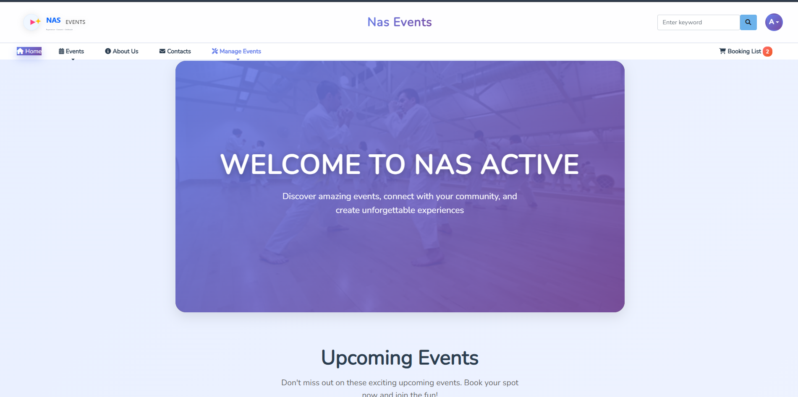
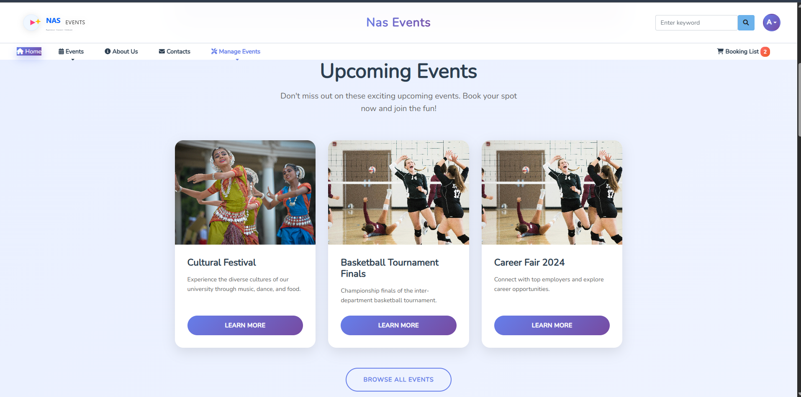
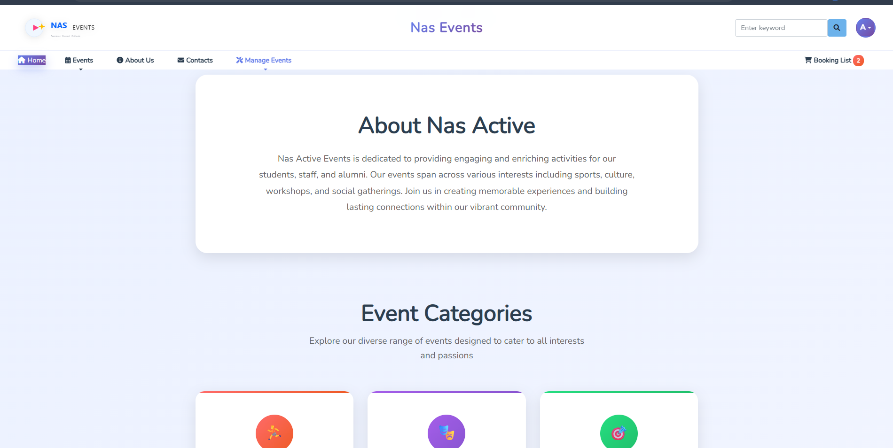
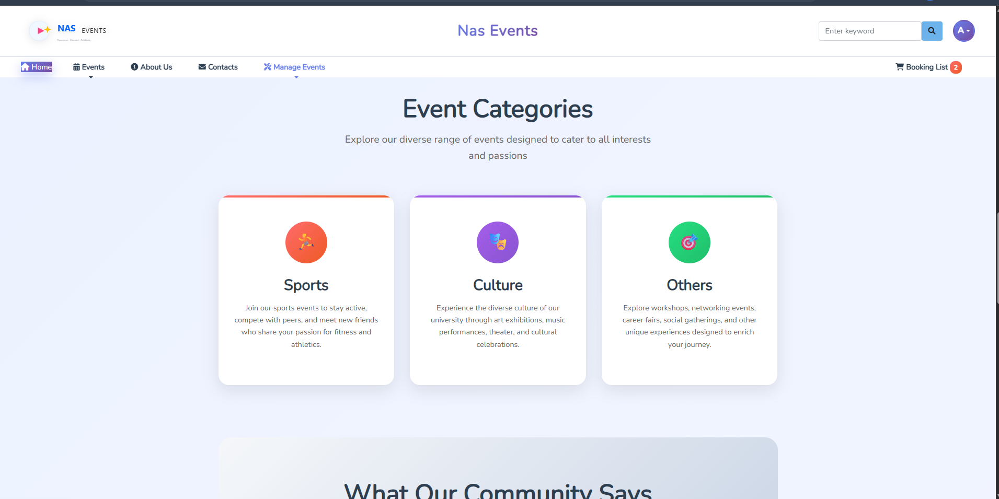
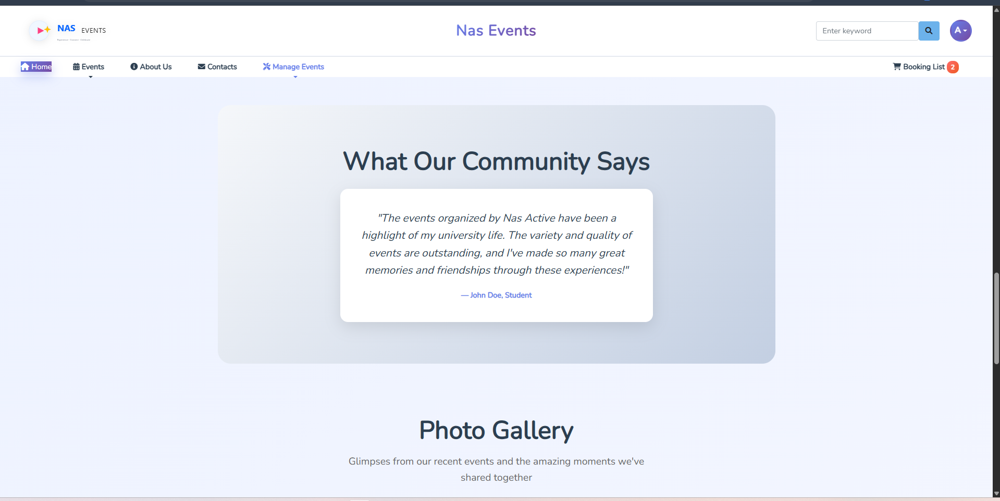
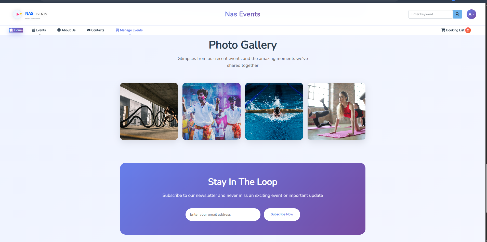
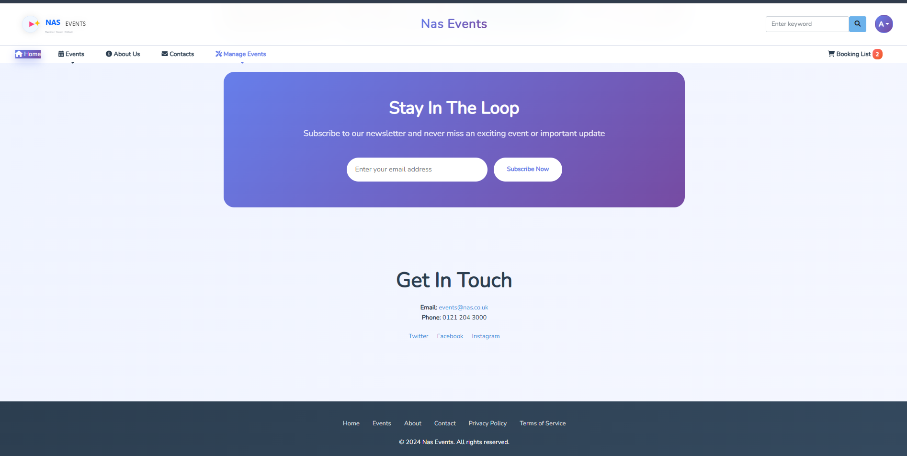


### Events Page
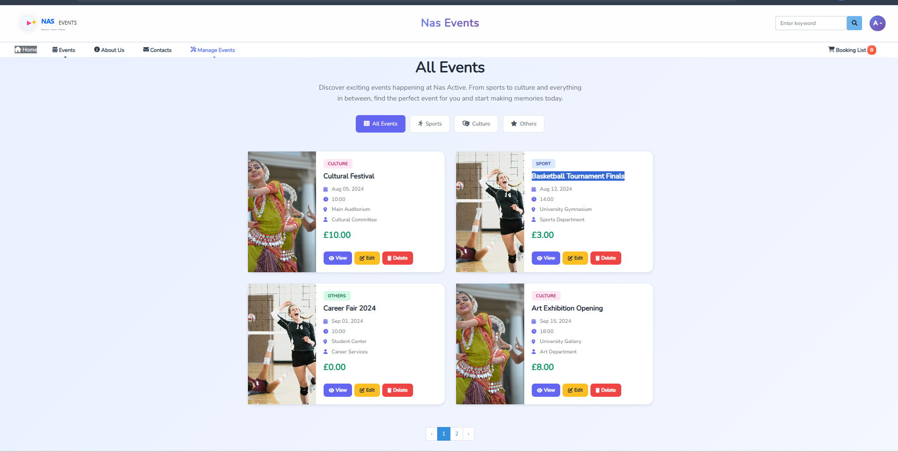 
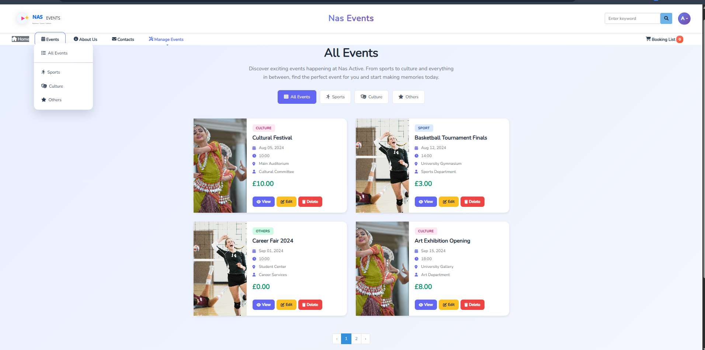
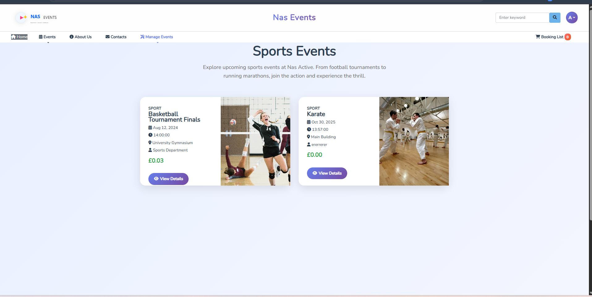
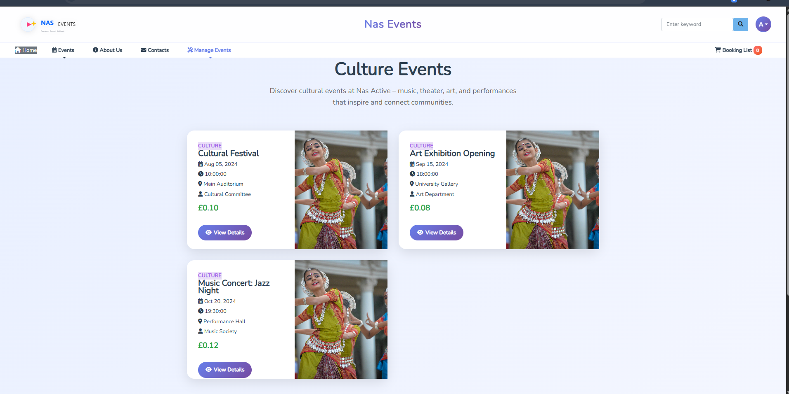


### Event Details
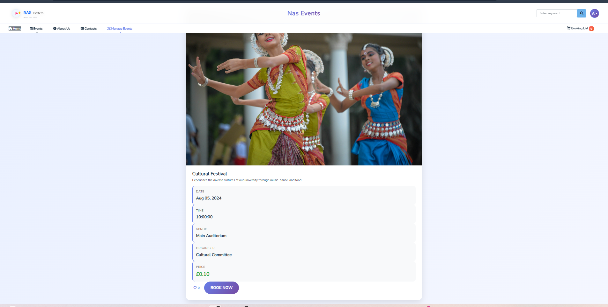

### Event Bookings
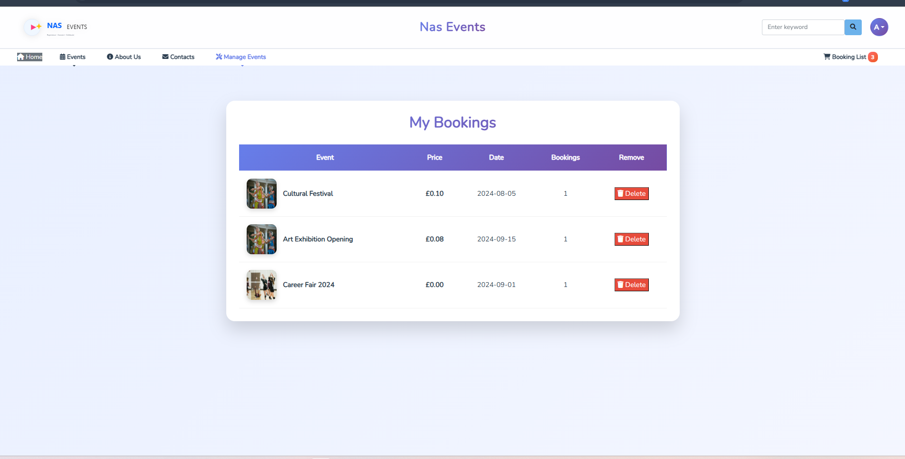

### Contacts
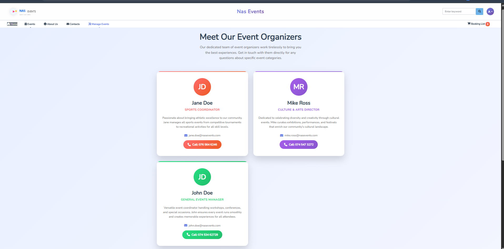
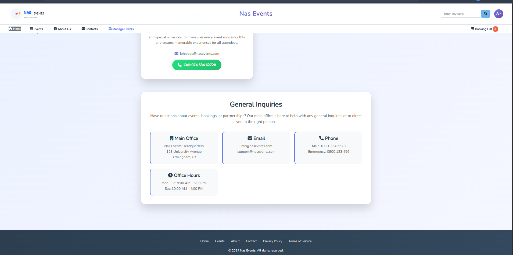

### Manage Events(CRUD, Create,Read,Upate and Delete)
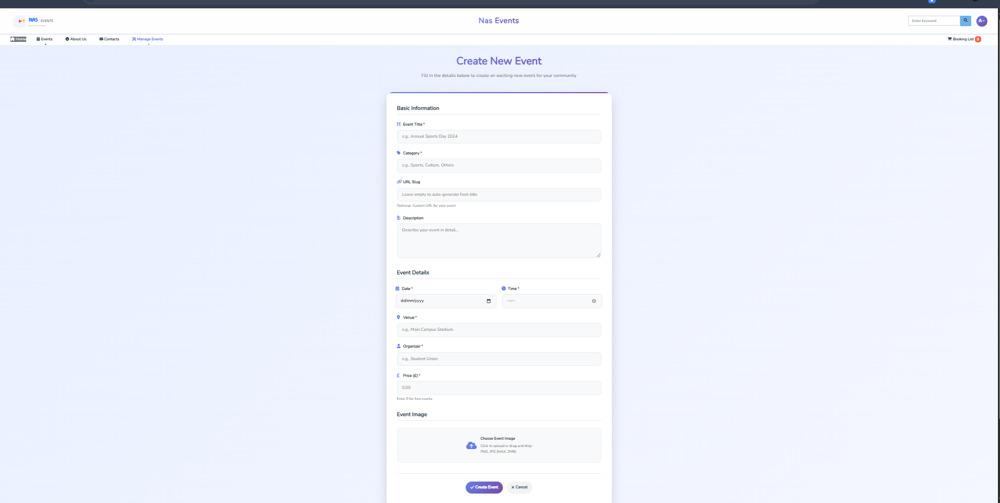
 


### Admin and User Dashboard
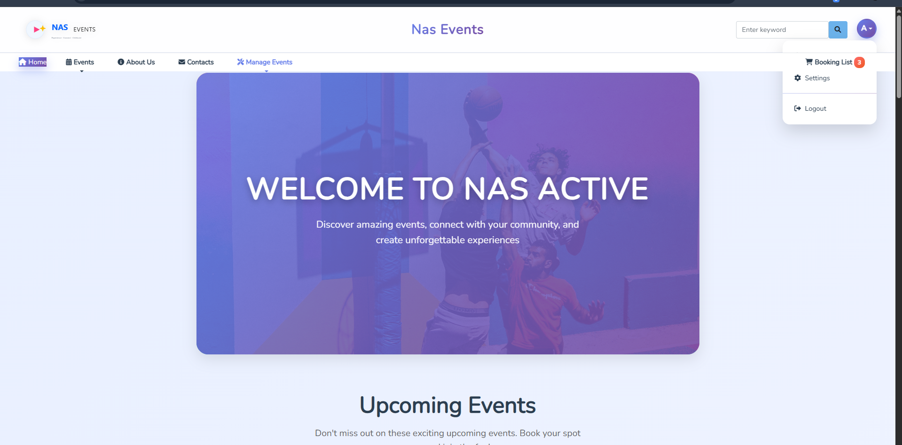
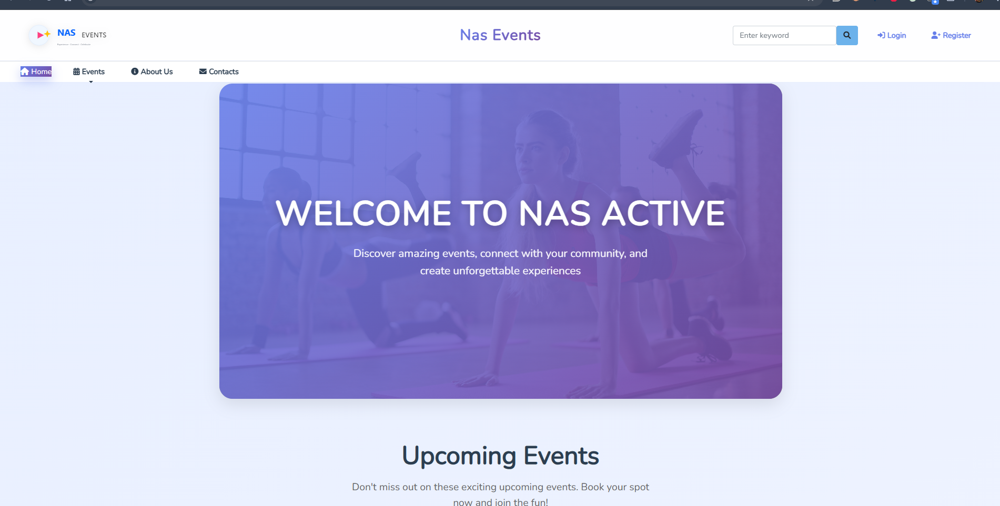
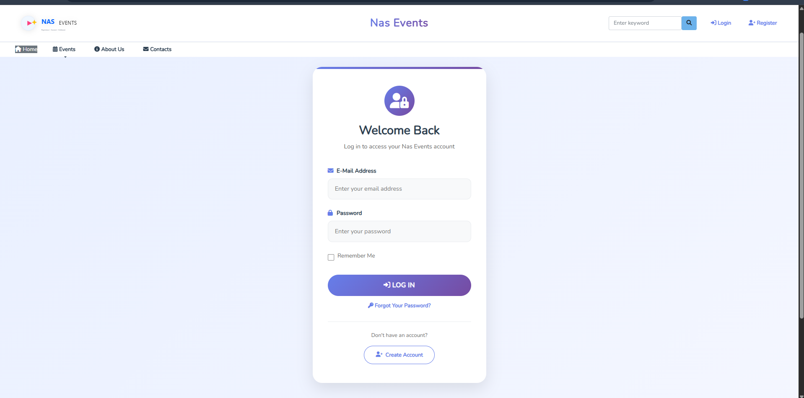
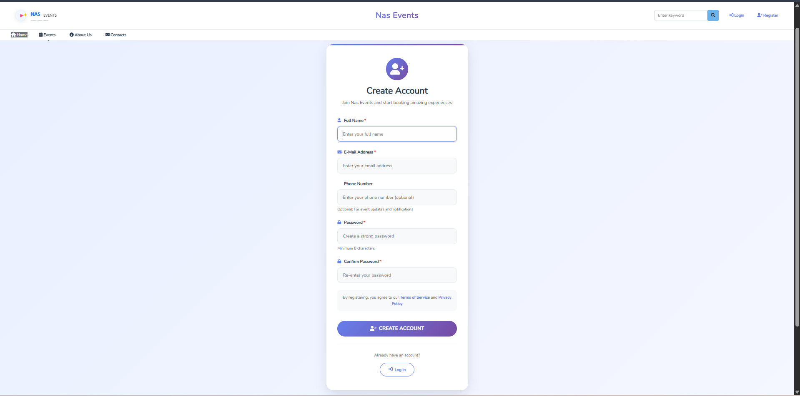


## 🚢 Deployment

This project is deployed on Railway. To deploy your own instance:

1. Create a [Railway](https://railway.app) account
2. Connect your GitHub repository
3. Add MySQL database service
4. Configure environment variables:
   - `APP_KEY`
   - `APP_ENV=production`
   - `APP_DEBUG=false`
   - Database credentials (auto-injected by Railway)
5. Add custom start command: `php artisan migrate --force && php artisan serve --host=0.0.0.0 --port=$PORT`
6. Deploy!

## 🐛 Troubleshooting

### Database Connection Issues
- Ensure MySQL is running in XAMPP
- Verify database credentials in `.env` file
- Check if the database exists in phpMyAdmin

### 500 Server Error
- Check Laravel logs at `storage/logs/laravel.log`
- Ensure `APP_KEY` is set: `php artisan key:generate`
- Verify file permissions on `storage/` and `bootstrap/cache/`

### Permission Issues
Make directories writable:
```bash
chmod -R 775 storage bootstrap/cache
```

On Windows, ensure the directories are not read-only.

### Images Not Displaying
- Run `php artisan storage:link`
- Create `public/img` directory if missing
- Check file permissions

### Routes Not Working
Clear route cache:
```bash
php artisan route:clear
php artisan config:clear
php artisan cache:clear
```

## 🤝 Contributing

Contributions, issues, and feature requests are welcome!

1. Fork the Project
2. Create your Feature Branch (`git checkout -b feature/AmazingFeature`)
3. Commit your Changes (`git commit -m 'Add some AmazingFeature'`)
4. Push to the Branch (`git push origin feature/AmazingFeature`)
5. Open a Pull Request

## 📝 License

This project is open source and available under the [MIT License](LICENSE).

## 👨‍💻 Author

**Asukulu Eugene Ndela**

- GitHub: [@asukulu](https://github.com/asukulu)
- LinkedIn: [Asukulu Eugene Ndela](https://www.linkedin.com/in/asukulu-eugene-ndela-545377213/)
- Email: eugenendela@yahoo.com

## 🙏 Acknowledgments

- [Laravel Documentation](https://laravel.com/docs)
- [Bootstrap Framework](https://getbootstrap.com)
- [Font Awesome Icons](https://fontawesome.com)
- [Railway Platform](https://railway.app)

---

<div align="center">

⭐️ If you found this project helpful, please give it a star!

Made with ❤️ by Asukulu Eugene Ndela

</div>